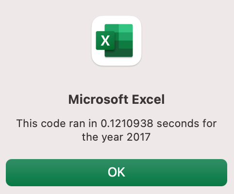

# Stock-Analysis
## Challenge 2: VBA
### Susan Tsoglin

## Overview of theProject

#### Purpose
The purpose of this project is twofold:
1. The first purpose is to analyze stock data for twelve stocks over a period of two years (2017 and 2018). We want to determine the success of each stock for each year, by looking at:
   - the value of the stock at the end of each year and compare it to the value of at the beginning of each year
    - the amount of trade volume for each stock
By analysing each stock, we are able to determine which stocks performed the best each year, so as to inform us which stock we may want to invest in.
2. The second purpose is to refactor, or edit, our original code to be more efficient and to run faster.

## Results

#### Analysis

1. In the year 2017, a majority of the stocks (11 of 12), had a positive rate of return. Some of these stocks performed much better than others. Only one stock declined in value (TERP), as you can see in the image below:

  In the year 2018, a majority of these same stocks declined in value. Only two of the stocks had a positive rate of return, as youcan see in the image below:
    

2. Our original code created a single array: ticker. For our other variables: volume, starting price, ending price, we did not create arrays. In addition, though we did initialize our totalVolume as 0, we didn't declare it as a specific type of variable. Declaring a specific type of variable for totalVolume would decrease the amount of bytes used. In our refactored code, we declared our tickerVolume as Long, which uses far fewer bytes than as variant. We created three additional arrays, which are faster to loop through than ranges. As a result, the amount of time that it took for the macro to run was significantly decreased.

    For example, please see below for the run-time of our original code for the year 2017:
   

    Please see below for the run-time of the refactored code for the year 2017:
   

## Summary

#### Advantages of Refactoring Code
1. Refactoring may reduce runtime, especially for very large data sets
2. Finding and eliminating useless code that may take time to run but does not produce any actual results
3. Create a cleaner code

#### Disadvantages of Refactoring Code
1. Refactoring may results in errors and the need to debug additional code
2. Taking a lot of time with the possibility of negligible measurable results
3. Getting stuck and not knowing what to do to improve the original code

#### Advantages of the Original VBA Script
1. The original VBA script had fewer objects and declarations to get the same results
2. It took less time to write
3. It was easier to make sense of for somebody new to code

#### Disadvantages of the Original VBA Script
1. Some objects were declared while others were not, which creates confusion for somebody new to code; I asked a lot of "why?" during this module

#### Advantages of the Refactored VBA Script
1. The script runs faster

#### Disadvantages of the Refactored VBA Script
1. So many objects start with "ticker" that it is difficult to differentiate between them and know which one to use
2. How the tickerIndex works remain unclear to me as a new user of VBA and new to code in general

